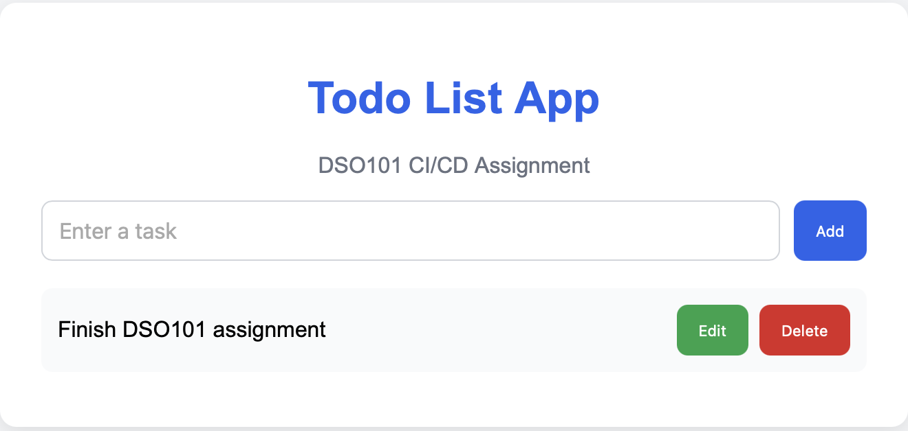
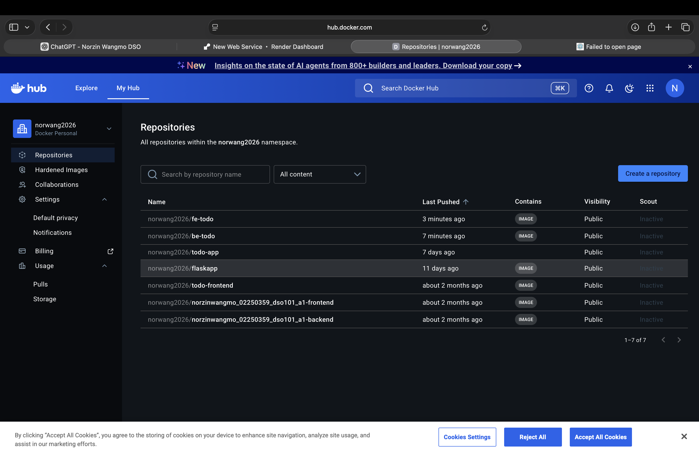

# Practical 1 — Docker Environment & Containerized Web Application

**Student ID:** 02250359  
**Module:** DSO101  
**Weekly practical:** Set up a Docker environment and containerize a simple web application  
**Related work:** Assignment I — `todo_app/` (Frontend + Backend Dockerfiles)

---

## Aim

Install and use Docker to run and containerize a simple web application, understanding images, containers, and basic Dockerfile syntax.

## Technologies

| Technology | Purpose |
|------------|---------|
| Docker | Container runtime |
| Dockerfile | Image build instructions |
| Docker CLI | Pull, build, run, manage containers |
| Node.js + Express | Backend web application |
| HTML/CSS/JS | Frontend web application |

## Activities completed

- Installed Docker and verified with `docker --version`  
- Built separate images for frontend and backend using Dockerfiles  
- Ran containers locally and tested API connectivity  
- Pushed images to Docker Hub (`norwang2026/be-todo`, `norwang2026/fe-todo`)  

## Evidence (screenshots)

### Local backend running in Docker

### Docker Hub — published images

### Frontend container logs

See **Reflection.md** for learning outcomes and challenges.
