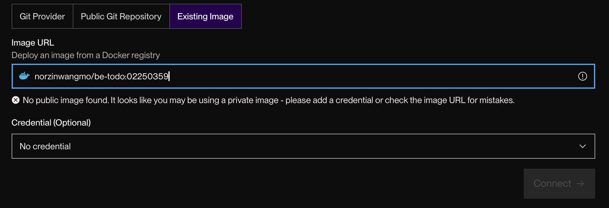

# Practical 2 — Multi-Container Application with Docker Compose

**Student ID:** 02250359  
**Module:** DSO101  
**Weekly practical:** Create a multi-container application using Docker Compose  
**Related work:** Assignment I architecture (frontend + backend + PostgreSQL)

---

## Aim

Define and run a multi-service application using Docker Compose: services, networks, and volumes for local development.

## Technologies

| Technology | Purpose |
|------------|---------|
| Docker Compose | Multi-container orchestration |
| Docker networks | Service-to-service communication |
| Docker volumes | Data persistence (PostgreSQL) |
| PostgreSQL | Database service |
| Node.js + Express | API service |

## Application design

The Todo application is inherently multi-container:

- **Frontend** — static/UI container  
- **Backend** — Express API container  
- **Database** — PostgreSQL (managed on Render; Compose concepts applied for local multi-service design)

## Key Compose concepts covered

- Defining multiple `services` in a Compose file  
- Linking services on a shared network  
- Environment variables for DB connection strings  
- Scaling and dependency concepts from module Unit II  

## Evidence (screenshots)

### Backend service live (Render)

### Frontend service live (Render)

### Multi-service deployment

See **Reflection.md**.
