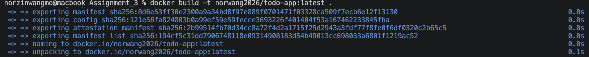
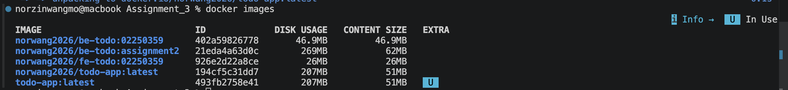
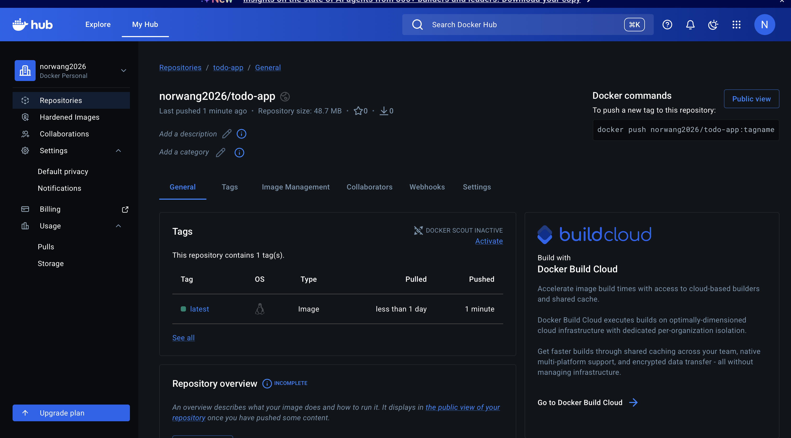

# Practical 3 — Docker Image Optimization & Security

**Student ID:** 02250359  
**Module:** DSO101  
**Weekly practical:** Optimize a Docker image for production and implement basic security measures  
**Related work:** Assignment I & III Dockerfiles, Render deployments

---

## Aim

Apply image optimization and basic security practices: smaller images, correct platform targets, and safe configuration.

## Technologies

| Technology | Purpose |
|------------|---------|
| Docker / buildx | Multi-platform builds |
| Dockerfile best practices | Layer caching, minimal images |
| `.dockerignore` | Exclude unnecessary files |
| Environment variables | Secrets not baked into images |

## Practices applied

- Built images for **`linux/amd64`** for cloud compatibility (Render)  
- Used `.dockerignore` to reduce build context  
- Avoided hard-coding credentials; used env vars at runtime  
- Tagged images clearly on Docker Hub for traceable deploys  

## Evidence (screenshots)

### Docker build output

### Docker images list

### Docker Hub repository

See **Reflection.md**.
