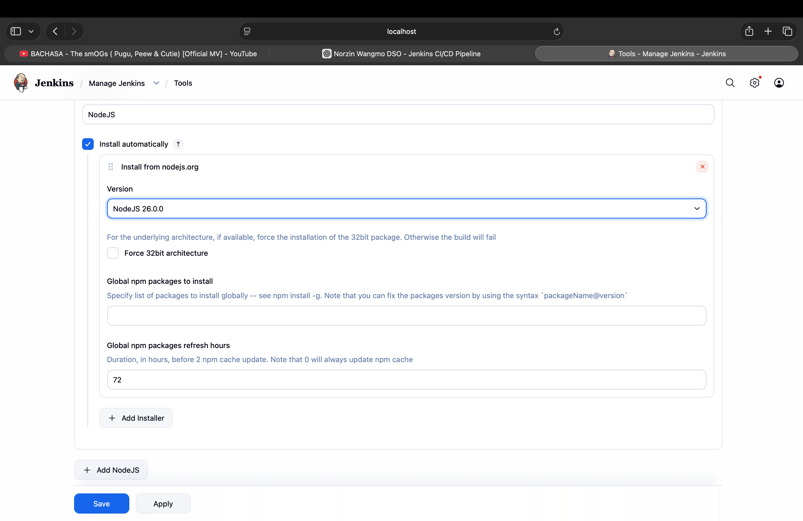
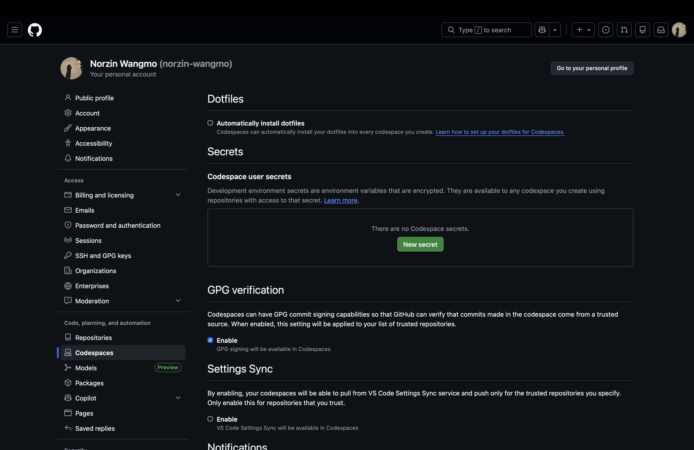
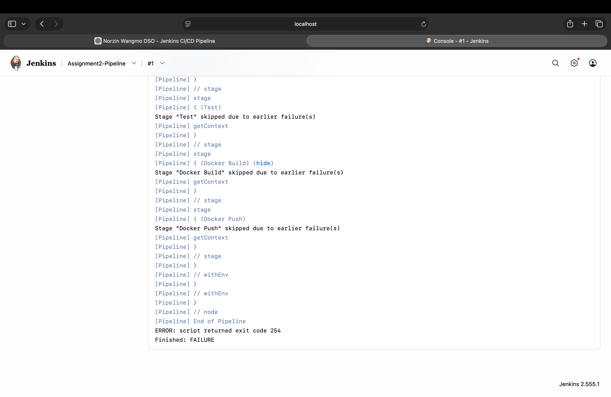

# Practical 4 — Jenkins Server & Basic CI/CD Pipeline

**Student ID:** 02250359  
**Module:** DSO101  
**Weekly practical:** Set up a Jenkins server and create a basic CI/CD pipeline for a Git repository  
**Related work:** Assignment II — `Assignments/Assignment_2/backend/`

---

## Aim

Install Jenkins, connect a GitHub repository, and run an automated pipeline for build and integration.

## Technologies

| Tool | Purpose |
|------|---------|
| Jenkins | CI server |
| GitHub | SCM / webhook trigger |
| Node.js | Application under test |
| Docker | Build agent integration (introduced) |

## Setup completed

- Jenkins installed and configured on macOS  
- NodeJS tool plugin configured  
- GitHub credentials (`GitHub-creds`) for repository access  
- Initial pipeline job linked to Assignment 2 backend repo path  

## Pipeline focus (basic)

- Checkout from Git  
- Install dependencies  
- Early build/test steps before full declarative pipeline (Practical 5)  

## Evidence (screenshots)

### Jenkins NodeJS tool configuration

### GitHub credentials

### Pipeline job configuration

See **Reflection.md**.
