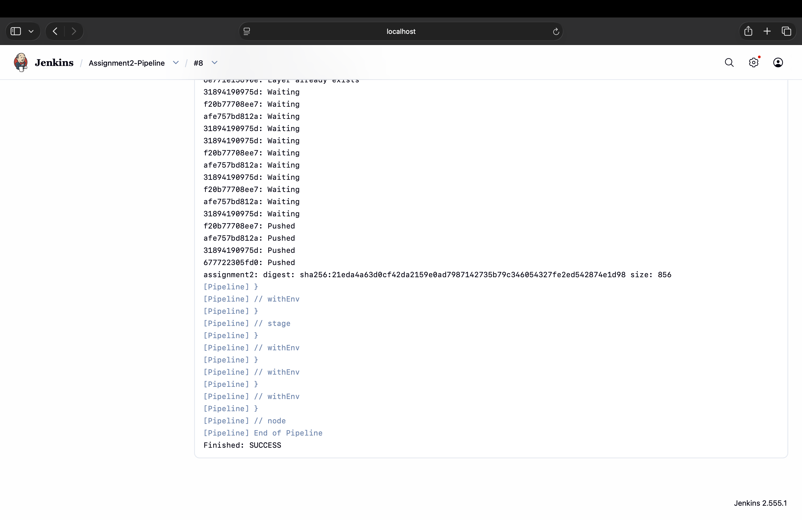
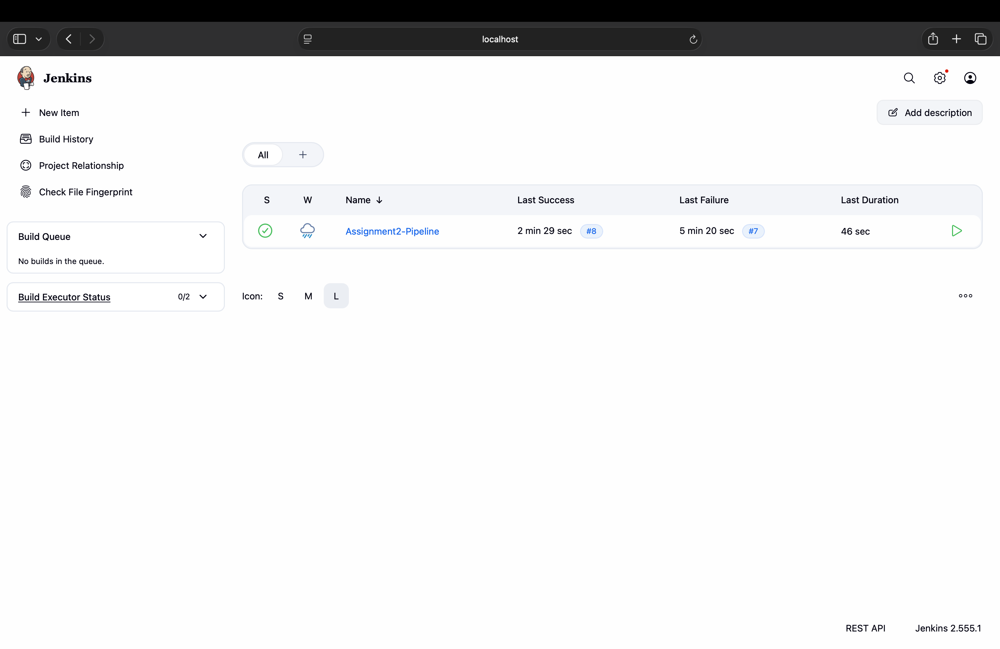

# Practical 5 — Jenkins Declarative Pipeline (Build, Test, Deploy)

**Student ID:** 02250359  
**Module:** DSO101  
**Weekly practical:** Implement a Declarative Pipeline in Jenkins with multiple stages (build, test, deploy)  
**Related work:** Assignment II — `Jenkinsfile`

---

## Aim

Author a declarative `Jenkinsfile` with distinct stages for install, build, test, Docker build, and deploy/push.

## Technologies

| Tool | Purpose |
|------|---------|
| Jenkins Declarative Pipeline | `pipeline { stages { ... } }` syntax |
| Jest | Unit tests |
| Docker | Image build in pipeline |
| Docker Hub | Image registry |

## Pipeline stages

1. Install dependencies  
2. Build  
3. Test (JUnit report published)  
4. Docker build  
5. Docker push  

## Project path

```text
Assignments/Assignment_2/backend/
├── Dockerfile
├── Jenkinsfile
├── server.js
└── __tests__/app.test.js
```

## Evidence (screenshots)

### Pipeline failure (debugging)



### Pipeline success — all stages



### Jenkinsfile in repository


See **Reflection.md**.
