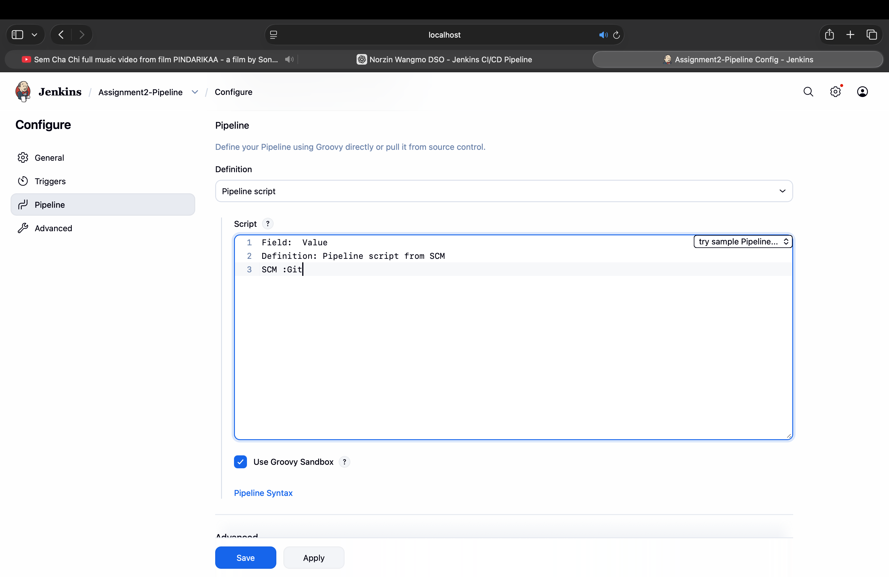
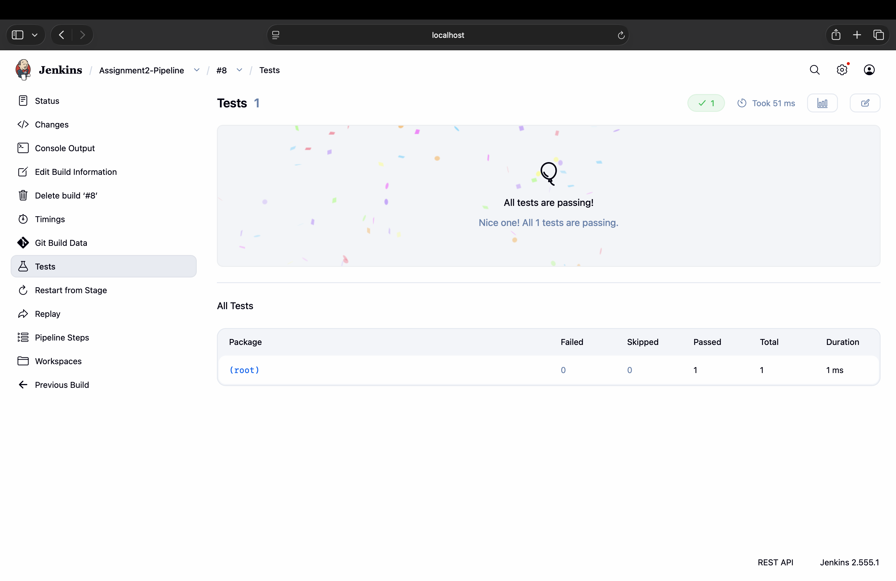
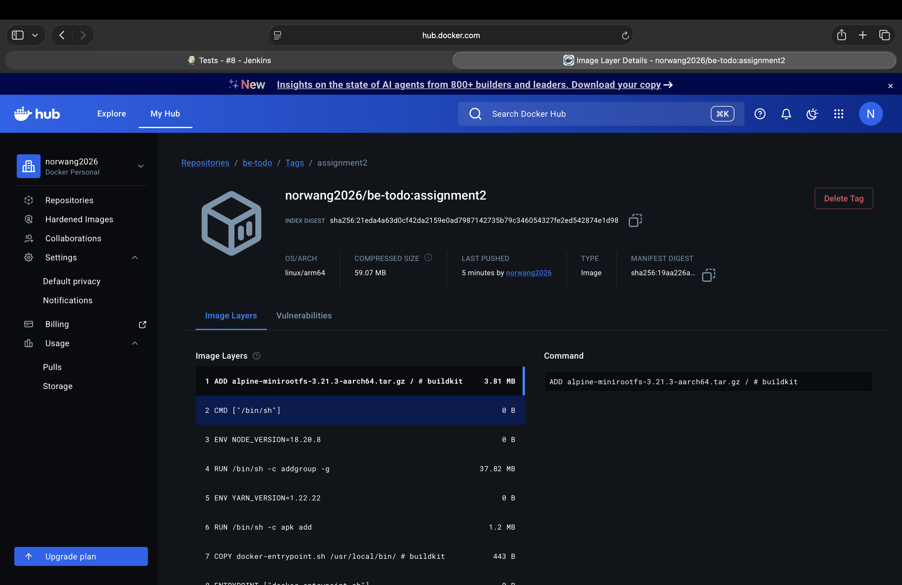

# Practical 6 — Jenkins Integration with External Tools & Registry

**Student ID:** 02250359  
**Module:** DSO101  
**Weekly practical:** Integrate external tools (e.g., package manager) and services (e.g., artifact registry) into a Jenkins pipeline  
**Related work:** Assignment II — npm, Jest, Docker Hub

---

## Aim

Extend the Jenkins pipeline with external tooling: npm for dependencies, Jest for testing, and Docker Hub as the artifact registry.

## Technologies

| Tool | Role in pipeline |
|------|------------------|
| npm | Install and build Node.js project |
| Jest | Automated unit tests |
| JUnit plugin | Test report in Jenkins UI |
| Docker Hub | Published container images (`docker-hub-creds`) |

## Integrations configured

- **Package manager:** `npm install` / `npm test` in pipeline stages  
- **Test reporting:** JUnit XML from Jest output  
- **Registry:** `docker login`, `docker build`, `docker push` with stored credentials  
- **GitHub:** PAT for cloning and triggering pipelines  

## Evidence (screenshots)

### Docker Hub credentials in Jenkins

### Jest test results in Jenkins

### Docker Hub — pushed image

See **Reflection.md**.
