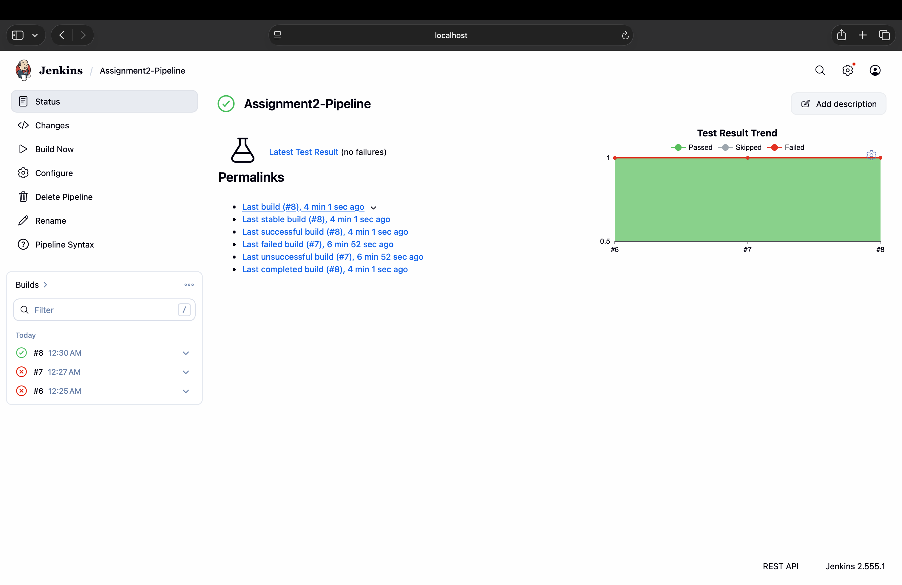
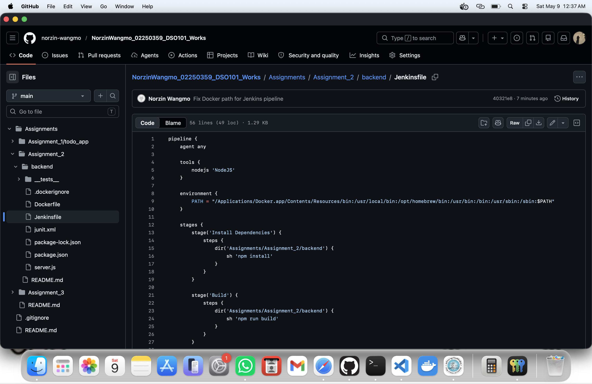

# Practical 7 — Jenkins Shared Library

**Student ID:** 02250359  
**Module:** DSO101  
**Weekly practical:** Create a shared library for Jenkins and use it in a pipeline  
**Related work:** Module Unit V — Pipeline as Code; patterns from Assignment II `Jenkinsfile`

---

## Aim

Understand Jenkins shared libraries for reusable pipeline steps and apply reusable stage patterns in pipeline-as-code.

## Concepts covered

| Concept | Application |
|---------|-------------|
| Shared library structure | `vars/`, `src/` layout (module theory) |
| Reusable pipeline steps | Common install/test/docker stages |
| Version-controlled pipeline code | `Jenkinsfile` in Git repository |
| DRY pipeline design | Repeated stages abstracted into functions (module objective) |

## Implementation notes

- Studied shared library pattern from lectures (Unit V.2)  
- Applied **reusable stage patterns** directly in the Assignment II declarative `Jenkinsfile` (install, test, docker push blocks)  
- Prepared pipeline structure so shared steps could be extracted to a library in a follow-on iteration  

## Relation to Assignment II

The Jenkinsfile uses consistent stage definitions that map to shared-library functions (`buildApp`, `testApp`, `dockerBuildPush`) as taught in the module—documented here as the practical deliverable aligned with reusable pipeline components.

## Evidence (screenshots)

### Jenkins dashboard — successful pipeline

### Pipeline-as-code (Jenkinsfile)

### Successful pipeline stages

See **Reflection.md**.
