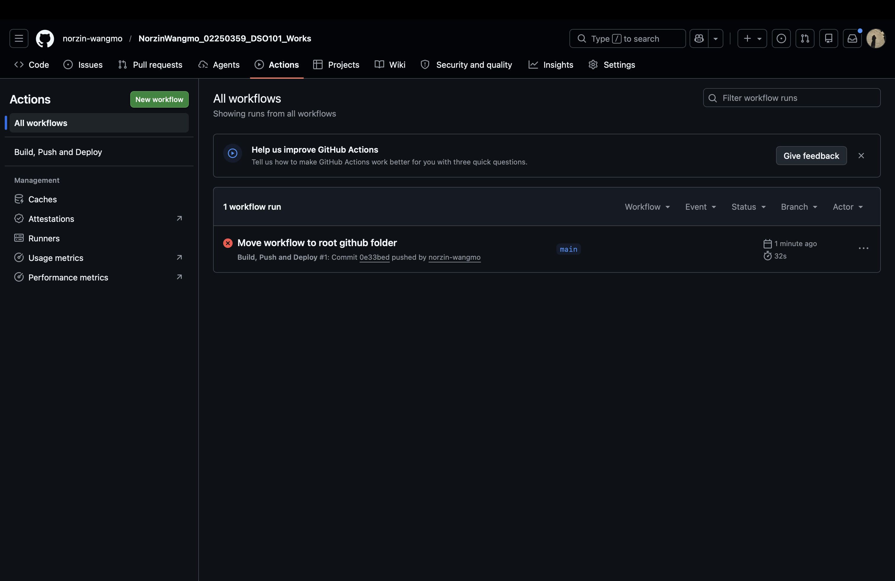
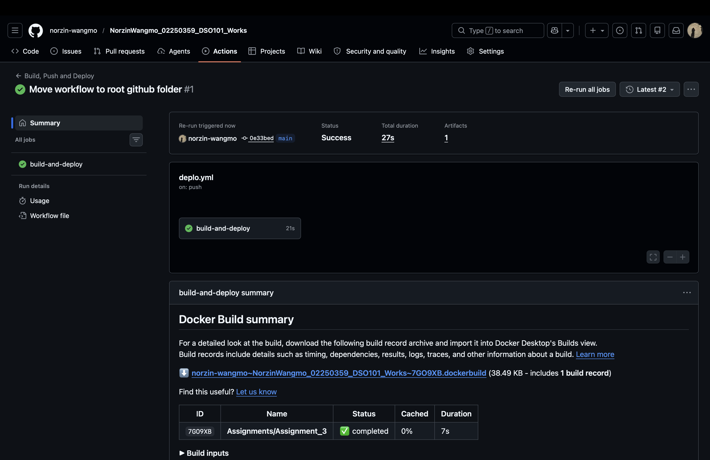
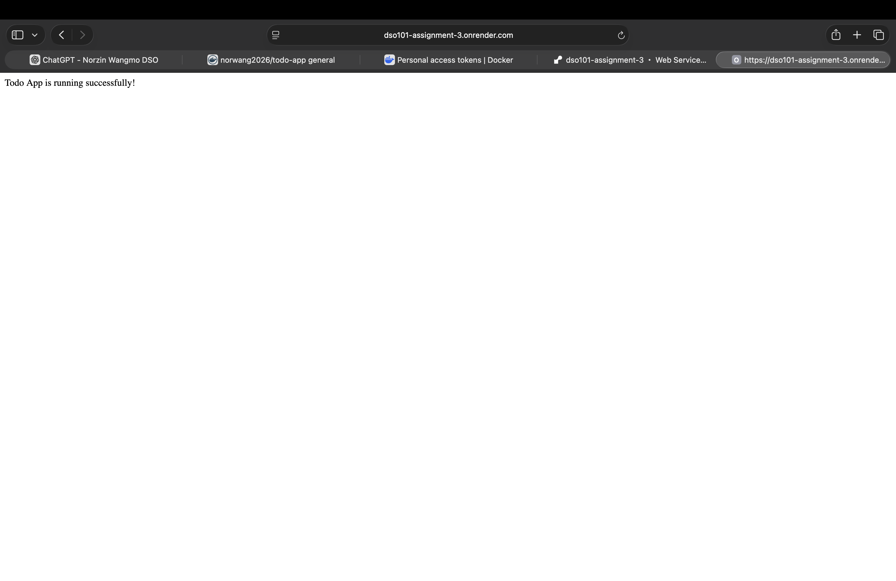
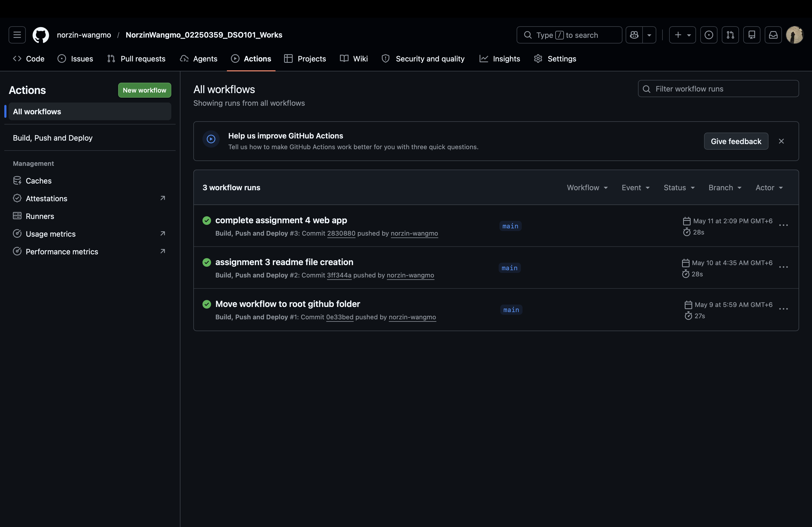

# Practical 8 — GitHub Actions CI/CD & Deployment

**Student ID:** 02250359  
**Module:** DSO101  
**Weekly practical:** Implement a complete CI/CD workflow using GitHub Actions and deploy to servers  
**Related work:** Assignment III — `Assignments/Assignment_3/`, Assignment IV static workflow

---

## Aim

Automate build, test, container publish, and deployment using GitHub Actions—modern cloud-native CI/CD.

## Technologies

| Technology | Purpose |
|------------|---------|
| GitHub Actions | Workflow automation |
| Docker / Docker Hub | Build and registry |
| Render | Cloud deployment (web service + static site) |
| Secrets | `DOCKERHUB_*`, `RENDER_DEPLOY_HOOK` |

## Workflows implemented

**Assignment III — container CD**

On push to `main`:

1. Checkout  
2. Docker Hub login  
3. Build `linux/amd64` image  
4. Push to Docker Hub  
5. Trigger Render deploy hook  

- Live API: https://dso101-assignment-3.onrender.com  
- Workflow: `.github/workflows/deploy.yml`

**Assignment IV — static site CI**

- HTML/CSS site with Actions verification workflow  
- Render Static Site: https://assignment-4-render-app.onrender.com  

## Evidence (screenshots)

### GitHub Actions — failed workflow (debugging)

### GitHub Actions — successful workflow

### Render — live container deployment

### Static site — GitHub Actions success

### Static site — live on Render

See **Reflection.md**.
